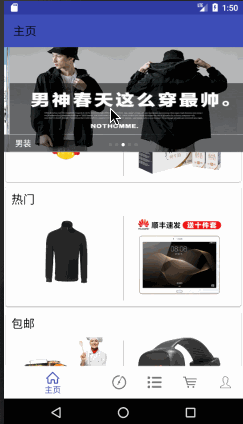

# Shop

## 先上效果图



## 说明

服务端采用Python开发，结合web.py框架。只简单的实现了功能。开始打算采用PHP的，后面发现环境都已卸载，刚好这段时间在学Python所以便用Python开发服务端

## 使用到的技术

Material Design、RxJava、Retrofit、ButterKnife、Picasso、Gson、LitePal

## 使用到的库

- [RxJava](https://github.com/ReactiveX/RxJava)
- [Retrofit](https://github.com/square/retrofit)
- [ButterKnife](https://github.com/JakeWharton/butterknife)
- [Picasso](https://github.com/square/picasso)
- [Gson](https://github.com/google/gson)
- [AndroidImageSlider](https://github.com/daimajia/AndroidImageSlider)
- [LitePal](https://github.com/LitePalFramework/LitePal)
- [web.py](http://webpy.org/)

## TODO

- [ ] 添加分享
- [ ] ​登录逻辑
- [ ] 订单
- [ ] 启动页
- [ ] 动画
- [ ] 主题切换

## License

```
Copyright 2017 binsheng

Licensed under the Apache License, Version 2.0 (the "License");
you may not use this file except in compliance with the License.
You may obtain a copy of the License at

    http://www.apache.org/licenses/LICENSE-2.0

Unless required by applicable law or agreed to in writing, software
distributed under the License is distributed on an "AS IS" BASIS,
WITHOUT WARRANTIES OR CONDITIONS OF ANY KIND, either express or implied.
See the License for the specific language governing permissions and
limitations under the License.
```